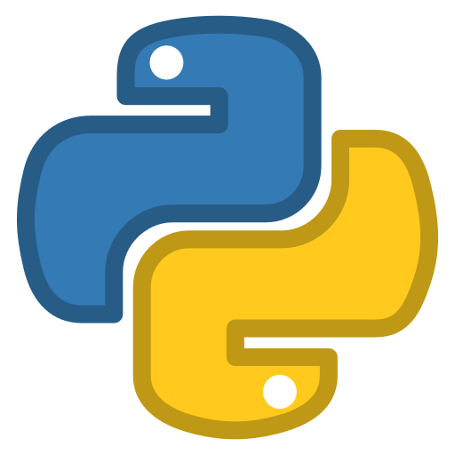

<h1 align="center"> 
  Apostila de Exercícios sobre Python 
  
</h1>
 
<h4 align="justify">
  Esta é uma lista com sugestões de programas para iniciantes em programação. Os exercícios podem ser implementados em Python, C, C++, Java, Pascal ou em qualquer outra linguagem. Os exercícios estão divididos em categorias e procuram obedecer uma ordem de dificuldade crescente. Cada exercício é independente do outro, sendo possível deixar exercícios para trás sem grandes prejuízos.
</h4>

 

<ul>
  <li>Estrutura de Decisão;</li>
  <li>Estrutura de Repetição;</li>
  <li>Funções</li>
</ul>
